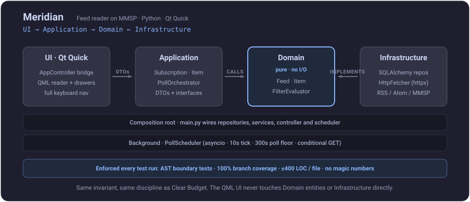

#  Meridian

A desktop feed reader and subscription manager built on the [MMSP](https://oernster.github.io/MMSP-Spec/) protocol. Supports RSS, Atom, podcast feeds, and YouTube channels with a native Qt Quick UI.


## Installation

### Pre-built releases

Download the latest installer for your platform from the [Releases page](https://github.com/oernster/meridian/releases).

### Run from source

```bash
# 1. Create and activate a virtual environment
python -m venv venv
venv\Scripts\activate        # Windows
source venv/bin/activate     # macOS / Linux

# 2. Install dependencies
pip install -r requirements.txt

# 3. Run
python -m meridian.main
```

Or, if installed as a package:

```bash
pip install -e .
meridian
```

### Linux: Flatpak

```bash
# Build (requires flatpak and flatpak-builder)
./build_flatpak.sh

# Install the generated bundle
flatpak install --user meridian.flatpak

# Run
flatpak run uk.codecrafter.Meridian

# Uninstall and remove all build artefacts
./cleanup_flatpak.sh
```

### macOS: DMG

```bash
# Build (requires macOS with Xcode command-line tools)
python builddmg.py

# The DMG will be written to dist/Meridian-<version>.dmg
# Open it, drag Meridian.app to Applications, then launch from Spotlight or Launchpad.
```

See [DEVELOPMENT.md](DEVELOPMENT.md) for Python version requirements, dev tooling, and how to run the test suite.

See [ARCHITECTURE.md](ARCHITECTURE.md) for the full project structure and design.

See [TECH_DEBT.md](TECH_DEBT.md) for the standing reference to what is still open, what is
deliberately left and what only looks like debt.

<p align="center">
  
</p>

## Sample Feeds

A `feeds_export.json` file is included in the repository with a curated set of RSS, Atom, and MFEED subscriptions ready to import.

To load them:

1. Launch Meridian
2. Open **File > Import Feeds...**
3. Select `feeds_export.json` from the repository root

All feeds will be added and begin polling immediately.

## Features

- Subscribe to RSS, Atom, podcast, and YouTube feeds
- Feed discovery by topic: search for candidate feeds via feedsearch.dev, preview results, subscribe individually or in bulk
- Per-feed filter expressions (MMSP Appendix A ABNF); filter dialog shows existing terms as toggleable rows
- Background polling with conditional GET and rate-limit backoff
- Bulk feed management with select-all checkboxes
- Import / export subscriptions as JSON
- Catppuccin Mocha / Latte theme toggle; preference persists across restarts
- Full-text `content:encoded` rendering for article feeds
- Full keyboard navigation throughout: every control reachable and operable without a mouse; Enter and Space activate focused items; Left/Right navigate between buttons and dialog footer actions; amber focus ring on all focusable controls; Escape closes open drawers and dialogs

## Single-device by design

Meridian is deliberately a single-device application. It does not sync your subscriptions or read state to a cloud account or between machines, and it has no server component. This is a design choice, not a missing feature: the MMSP protocol it is built on is pull-only and treats read state as a client concern, so Meridian keeps all of that state local to the machine it runs on.

To move your subscriptions to another machine, use the File menu to export your subscriptions to a `feeds_export.json` file, then **File > Import Feeds...** on the other machine. JSON export/import is the migration path; it is not live sync, and read state does not transfer.

## License

Meridian is dual-licensed, split by component:

- **Model** (`meridian/domain`, `meridian/application`, `meridian/infrastructure`, `main.py`, `version.py`, build scripts and tests): Apache-2.0, aligning with the MMSP specification ecosystem. See [LICENSE-APACHE-2.0.txt](LICENSE-APACHE-2.0.txt).
- **User interface** (`meridian/ui`) only: LGPL-3.0-or-later, to align with Qt's licensing. See [LICENSE-LGPL-3.0.txt](LICENSE-LGPL-3.0.txt).

See [LICENSE](LICENSE) for the component map and [ARCHITECTURE.md](ARCHITECTURE.md) for third-party licence notes.
